# elephant42 の組み立てかた

自作キーボードキット [elephant42](https://illness072.booth.pm/items/1775017) のビルドガイド(組立説明書)です。

**組み立ての前に、このビルドガイドを先に読んで理解して、材料・工具等を揃え、環境構築をし、最後に実際の組立作業を行ってください。**

**なにか良くわからない、うまくいかないときは、ガッカリしてそこで諦めてしまわずに[私に連絡](https://twitter.com/illness072/)してみてください。できる限り力になる努力をしたいと思います。**

「なにをしようとして」「なにをしたけど」「どうなってしまっているのか」をわかりやすいように質問して頂けるとスムーズです。


<!-- START doctoc generated TOC please keep comment here to allow auto update -->
<!-- DON'T EDIT THIS SECTION, INSTEAD RE-RUN doctoc TO UPDATE -->


- [準備](#%E6%BA%96%E5%82%99)
  - [キット内容の確認](#%E3%82%AD%E3%83%83%E3%83%88%E5%86%85%E5%AE%B9%E3%81%AE%E7%A2%BA%E8%AA%8D)
  - [必要部品の調達](#%E5%BF%85%E8%A6%81%E9%83%A8%E5%93%81%E3%81%AE%E8%AA%BF%E9%81%94)
    - [必須](#%E5%BF%85%E9%A0%88)
    - [オプション](#%E3%82%AA%E3%83%97%E3%82%B7%E3%83%A7%E3%83%B3)
  - [工具の準備](#%E5%B7%A5%E5%85%B7%E3%81%AE%E6%BA%96%E5%82%99)
    - [必要なもの](#%E5%BF%85%E8%A6%81%E3%81%AA%E3%82%82%E3%81%AE)
    - [あると良いもの](#%E3%81%82%E3%82%8B%E3%81%A8%E8%89%AF%E3%81%84%E3%82%82%E3%81%AE)
    - [買い物をする上で参考になるもの](#%E8%B2%B7%E3%81%84%E7%89%A9%E3%82%92%E3%81%99%E3%82%8B%E4%B8%8A%E3%81%A7%E5%8F%82%E8%80%83%E3%81%AB%E3%81%AA%E3%82%8B%E3%82%82%E3%81%AE)
  - [(初心者向け) はんだ付けの勉強](#%E5%88%9D%E5%BF%83%E8%80%85%E5%90%91%E3%81%91-%E3%81%AF%E3%82%93%E3%81%A0%E4%BB%98%E3%81%91%E3%81%AE%E5%8B%89%E5%BC%B7)
  - [ファームウェアの書き込み](#%E3%83%95%E3%82%A1%E3%83%BC%E3%83%A0%E3%82%A6%E3%82%A7%E3%82%A2%E3%81%AE%E6%9B%B8%E3%81%8D%E8%BE%BC%E3%81%BF)
    - [QMK firmware ビルド環境の構築](#qmk-firmware-%E3%83%93%E3%83%AB%E3%83%89%E7%92%B0%E5%A2%83%E3%81%AE%E6%A7%8B%E7%AF%89)
  - [Pro Micro のもげ対策](#pro-micro-%E3%81%AE%E3%82%82%E3%81%92%E5%AF%BE%E7%AD%96)
- [組み立て作業](#%E7%B5%84%E3%81%BF%E7%AB%8B%E3%81%A6%E4%BD%9C%E6%A5%AD)
  - [QMK firmware の書き込み](#qmk-firmware-%E3%81%AE%E6%9B%B8%E3%81%8D%E8%BE%BC%E3%81%BF)
    - [トラブルシューティング](#%E3%83%88%E3%83%A9%E3%83%96%E3%83%AB%E3%82%B7%E3%83%A5%E3%83%BC%E3%83%86%E3%82%A3%E3%83%B3%E3%82%B0)

<!-- END doctoc generated TOC please keep comment here to allow auto update -->


# 準備

## キット内容の確認

内容物に不足や破損などがないか確認してください。

|  |  |  |  |
|:--:|:--:|:--:|:--:|
|メイン基板(PCB) ... 1枚|トッププレート ... 2枚<br/>(薄くて穴が小さい方)|ミドルプレート ... 2枚<br/>(厚くて穴が大きい方)|ボトムプレート ... 2枚|
|  | 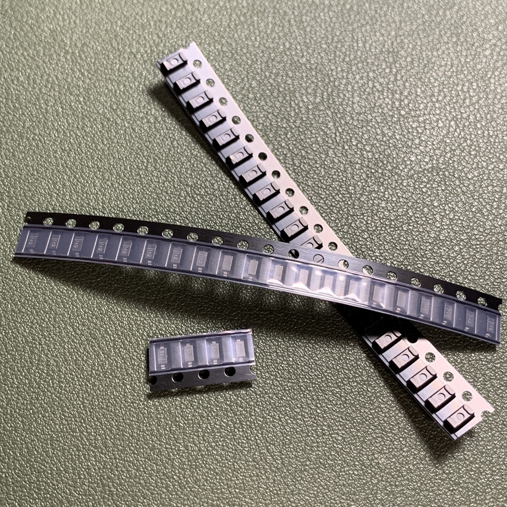 |  |  |
| ProMicro 保護プレート ... 2枚 | ダイオード ... 44個<br/>(予備2個) | MX 互換スイッチ用<br/>PCB ソケット ... 42個 | TRRS ジャック ... 2個 |
|  |  | 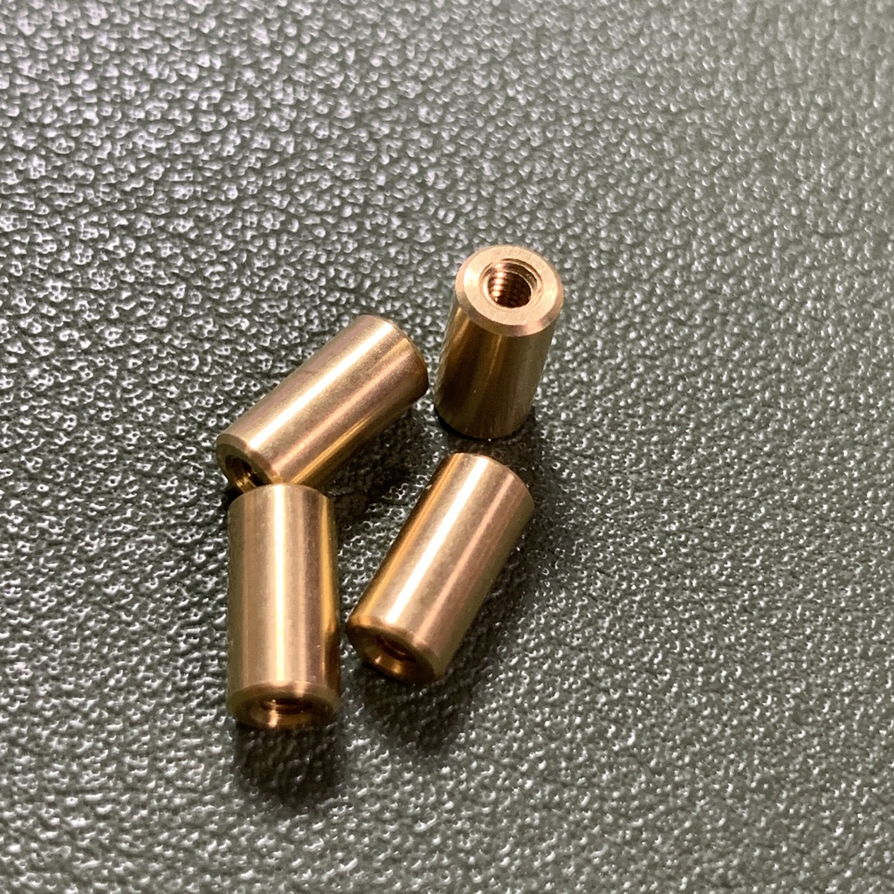 | 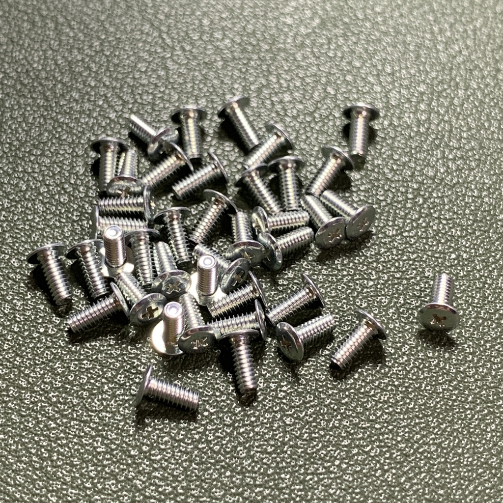 |
| タクトスイッチ ... 2個<br/>※色は異なる場合があります | スペーサー(短) ... 20本 | スペーサー(長) ... 4本 | ネジ ... 40本 |
|  ||||
| クッションゴム ... 10個 ||||


## 必要部品の調達

キットに含まれていないが必要なものを購入します。

初心者向けのおすすめ購入先 (国内通販) のリンクも併せて載せておきますので参考にしてください。

### 必須

- Pro Micro(コンスルー付き) ... 2組
   - おすすめ購入先
     - [Pro Micro （コンスルー付き）| 遊舎工房](https://yushakobo.jp/shop/promicro-spring-pinheader/) ※2つ購入してください
     - TALP KEYBOARD
       - [Pro Micro ATmega32U4 5V/16MHz/MicroUSB2(互換品)](https://talpkeyboard.stores.jp/items/5b24504ba6e6ee7ec60063e3) ※2つ購入してください
       - [MAC8 コンスルー XB-3-2.5-12P (高さ2.5mm/12ピン/1個)](https://talpkeyboard.stores.jp/items/5e056626d790db16e2889233) ※4つ購入してください
     - Amazon などで非常に安価な Pro Micro が複数個セットで販売されていますが、結構な確率で粗悪品を掴むのでちゃんとした店で購入した方が無難です。
- MX 互換スイッチ ... 42個
   - おすすめ購入先
     - [Switches | 遊舎工房](https://yushakobo.jp/product-category/switches/)
     - [TALP KEYBOARD](https://talpkeyboard.stores.jp/?category_id=59cf8860ed05e668db003f5d)
     - [SWITCHES - ゆかりキーボードファクトリー](https://eucalyn.shop/product-category/keyswitches)
   - 「Kailh ロープロファイル (Choc) スイッチ」および「Kailh Mid-Heightスイッチ」は非対応ですのでご注意ください。
- 1Uキーキャップ ... 42個
   - おすすめ購入先
     - [Keycaps | 遊舎工房](https://yushakobo.jp/product-category/keycaps/)
     - [TALP KEYBOARD](https://talpkeyboard.stores.jp/?category_id=59be183f428f2d49120007b1)
     - [KEYCAPS - ゆかりキーボードファクトリー](https://eucalyn.shop/product-category/keycaps)
   - キースイッチと同じく「Kailh ロープロファイル (Choc) スイッチ」用のキーキャップは非対応ですのでご注意ください。
- TRSケーブル ... 1本
    - AUX ケーブル、ステレオミニプラグケーブルなどとも呼ばれています。所謂イヤホンのプラグが両方についてるケーブルです。
      - Amazon などで見た目が良いものが売られています
    - elephant42 が必要とするのは 3 極(黒線が2本入るタイプ)の TRS ケーブルですが、自作キーボードショップなどでよく売られている 4 極(黒線が3本入るタイプ) の TRRS ケーブルでも代用可能です。
      - [TRRSケーブル 1m | 遊舎工房](https://yushakobo.jp/shop/trrs_cable/)
- USB ケーブル (Type-A to Micro-B) ... 1本
    - 所謂 Micro USB ケーブルです。
      - Amazon などで見た目が良いものが売られています
      - [USBケーブル Micro B 1m | 遊舎工房](https://yushakobo.jp/shop/usb_cable_micro_b/)
      - [USB2.0ケーブル（0.6m/USB(A)オス - USB(Micro-B)オス) | TALP KEYBOARD](https://talpkeyboard.stores.jp/items/5df82904a551d528d7360c34)


### オプション

1. OLEDモジュール（ピンソケット付き） ... 2個
    - [OLEDモジュール | 遊舎工房](https://yushakobo.jp/shop/oled/) ※ピンソケット付きを選択してください
1. YS-SK6812MINI-E ... 54個
    - [YS-SK6812MINI-E（10個入り） | 遊舎工房](https://yushakobo.jp/shop/ys-sk6812mini-e/) ※6パック購入してください(6個余ります)
    - **従来品の「[SK6812MINI](https://yushakobo.jp/shop/sk6812mini-35/)」は互換性がないため使用できません。**
    - **※遊舎工房実店舗で購入する場合、見た目が非常に似通っている「[リバースマウント RGB LED](https://yushakobo.jp/shop/a0800rl-10/)」を誤って購入しないよう注意してください。互換性がないため使用できません。**


## 工具の準備

組み立てだけでなく、修理などでも工具は必要になります。また特に電子工作は、良い工具を使うと作業がぐっと簡単になります。
お財布と相談しつつ、なるべく良い工具を揃えると良いでしょう。

また、自宅から通いやすい場所に工作スペースがある場合は、そちらの利用も考慮すると良いかもしれません。

### 必要なもの

- はんだ
  - [goot 高密度集積基板用はんだ SD-60](https://www.amazon.co.jp//dp/B0029LGAJI/)
    - ほとんどの部品はこちらで取り付けます
  - [久富電機産業 SH-43 低温はんだ](https://www.sengoku.co.jp/mod/sgk_cart/detail.php?code=6A2W-CFJP)
    - LED(YS-SK6812mini-E) だけは高温で壊れる危険性があるため、念のためこちらを使っています
- はんだ吸い取り線
  - [goot はんだ吸取り線 CP-3015](https://www.amazon.co.jp/dp/B001PR1KPQ)
- はんだこて
  - [白光 ダイヤル式温度制御はんだこて FX600](https://www.amazon.co.jp/dp/B006MQD7M4)
  - **温度調整機能つきを強くおすすめします**
- こて台
  - [白光(HAKKO) こて台 633-01](https://www.amazon.co.jp/dp/B000TGNWCS)
- フラックス
  - [goot プリント基板フラックス BS-75B ](https://www.amazon.co.jp/dp/B004ANR7KY/)
  - なくてもできる! という人をたまに見かけますが、ほぼ間違いなく腕を自慢したい上級者です。特に LED をつける場合はほぼ必須と思ってください。
- フラックスクリーナー
  - [太洋電機産業(goot) フラックスリムーバー BS-T20B](https://www.amazon.co.jp/dp/B07JHJHTYG/)
  - 無洗浄タイプのフラックスなら不要というわけではありません。茶色くベタベタして汚らしく、また経年劣化で基板にダメージを与えるらしいので、なるべく使用するようにしてください。
- キムワイプ
  - [日本製紙クレシア キムワイプ S-200 mini 62015 1個入](https://www.amazon.co.jp/dp/B00CWA23P6)
- ふつうのピンセット
  - ダイソーで購入したものを使用。プラモデルと共用。
- ふつうのマスキングテープ
  - ダイソーで購入したものを使用。プラモデルと共用。
- 棒ヤスリ
  - ダイソーで購入したものを使用。プラモデルと共用。
- ふつうのカッターナイフ
  - 切れればなんでも良い。今回はプラモデルで使用するデザインナイフで代用。

### あると良いもの

- 赤の油性ペン
  - プラモデルで使用するガンダムマーカー(赤)で代用
- ふつうのニッパー
  - ダイソーで購入したものを使用
  - プラモデル用の良いニッパーは刃をダメにするので共用しないことをおすすめします。
- エポキシ系接着剤
  - ダイソーで購入したものを使用
- テスター
  - ほんとはあったほうが良いと思うけど、電池と電子ブザーとリード線を雑にくっつけただけの物を使用しています
- はんだ付け用作業マット
  - ほんとはあったほうが良いと思うけど、使ってません
- カッターマット
  - 机を傷つけなければ古新聞でも本キットの外箱でも何でも良い。今回はプラモデルで使用するものを使用

### 買い物をする上で参考になるもの

先人に学ぼう。

- [Helix キーボードキットの製作に必要な工具メモ | gist.github.com](https://gist.github.com/mtei/6957107a676ddfa85bde0ae41f8fa849)
- [第8回「自作キーボードのつくりかた #2」組み立てる道具とはんだ付け編 | Youtube](https://youtu.be/LOC53FeU-QM)
- [自作キーボードを作るために必要なもの | 自作キーボード温泉街の歩き方](https://salicylic-acid3.hatenablog.com/entry/2018/11/24/%E8%87%AA%E4%BD%9C%E3%82%AD%E3%83%BC%E3%83%9C%E3%83%BC%E3%83%89%E3%82%92%E4%BD%9C%E3%82%8B%E3%81%9F%E3%82%81%E3%81%AB%E5%BF%85%E8%A6%81%E3%81%AA%E3%82%82%E3%81%AE#%E8%87%AA%E4%BD%9C%E3%82%AD%E3%83%BC%E3%83%9C%E3%83%BC%E3%83%89%E3%81%A7%E5%BF%85%E8%A6%81%E3%81%AA%E3%82%82%E3%81%AE)
- [自作キーボードの組み立てに使っている工具 | yfuku blog](https://blog.yfuku.com/entry/keybord_build_tool)


## (初心者向け) はんだ付けの勉強

elephant42 は完成までに最低でもおよそ200箇所、最大でおよそ440箇所をはんだ付けすることになります。

人生初だったり、中学校以来久しぶりのはんだ付け、のような人はとくに、はんだ付けのやりかたを勉強しておくと良いです。

はやく完成させたい気持ちでここを飛ばしていきなり着手してしまうと、およそろくなメにあわないです。**ほんとに。**


はんだ付けの基本動作

https://youtu.be/ZA-ehWjRfYM

ProMicro、タクトスイッチ、TRRSジャックなどを実装する際にスルーホールをはんだ付けするため、こちらの動画で学習すると効率的です。

https://youtu.be/oq3Q3n57-B0

表面実装ダイオード、LEDなどをはんだ付けする方法は、こちらの動画で学習すると効率的でした。

https://youtu.be/vqKKElJ1vw0


## QMK firmware ビルド環境の構築

ファームウェアを準備するための手順はこちらに記述されています。

https://docs.qmk.fm/#/ja/newbs_getting_started


elephant42 は QMK Configurator や QMK Toolbox には対応していないため、上記URLを参考にビルド環境の構築を行ってください。

途中 `git clone --recurse-submodules https://github.com/qmk/qmk_firmware.git` を実行する箇所がありますが、elephant42 の場合は

```
git clone --recurse-submodules -b elephant42 https://github.com/illness072/qmk_firmware.git
```

としてください。

また、`make <keyboard>:default` の箇所は、

```
make elephant42:default
```

としてください。


## Pro Micro のもげ対策

必須ではありませんが、やっておくと悲しい思いをしなくなるので良いです。

以下の記事などを参考に、エポキシ接着剤を MicroUSB ジャック周辺に盛り付けて端子を強化します。

-  [ProMicroのモゲ防止ついでにQMK_Firmwareを書き込む](https://qiita.com/hdbx/items/2f3e4ddfcadda2a5578e)
- [マスキングテープを使って、安全にProMicroのモゲ対策をする](https://cnaos.hatenablog.com/entry/2019/03/16/153754)


# 組み立て作業

## QMK firmware の書き込み

Micro USB ケーブルを Pro Micro に挿し、PC に接続したうえで

```
make elephant42:default:flash
```

とすると書き込みが実行されます。処理が進み、実際の書き込みを行う準備が整うと

```
Detecting USB port, reset your controller now...
```

と表示されるので、接続している ProMicro の RST と GND の両方を同時に一瞬だけピンセットなどで触れてショートさせます。

すると、Pro Micro のパワーランプが点滅し、実際の書き込みが開始されます。

最後に以下のような表示が出たら、書き込みは完了です。

```
avrdude done.  Thank you.
```

これを左右 2 つぶんの Pro Micro 両方に対して実施してください。

**このとき、Pro Micro を勢いよく引っこ抜くと Micro USB ジャック が基板からもげて使い物にならなくなってしまいます。細心の注意を払ってゆっくり優しく真っ直ぐに抜くようにしてください。**

|  | 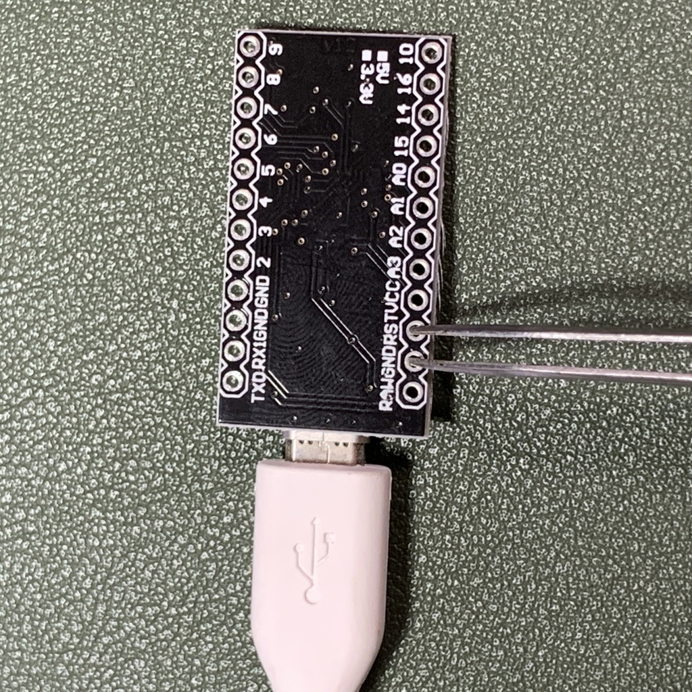 |
|--|--|
| PC に ProMicro を接続し、書き込みコマンドを起動します | 待機状態になったら、RST と GND を一瞬ショートさせて書き込み処理を実行します |

### QMK 書き込み トラブルシューティング

一部の環境では、コマンド実行時に以下のようなメッセージが出ることがあります。このときはそのまま Enter を押してしばらく待ち、書き込みが失敗して終わるのを待ちます。

```
sh: /tmp/1: Permission denied
.override rw-r--r--  root/wheel for /tmp/1? (y/n [n])
```

このように `permission denied` という文字列がでてエラーとなる場合は、

```
sudo make elephant42:default:flash
```

と書き換えて実行することで成功することができるかと思います。(パスワード入力を求められると思うので、アカウントのパスワードを入力してください。このとき画面には `****` だとか `●●●●` だとかは一切表示されませんが、それが普通なので気にせずパスワードを入力してEnterを押してください。)

## メイン基板 (PCB) の分割

PCB を 2 つに分割します。ミシン目に沿ってカッターで切り込みを入れ、手でゆっくり力をかけて折りとり、棒やすりで断面を整えます。

**カッターで基板の他の部分を傷つけないよう注意してください。**
**基板を折るさい、他の部分が折れたり曲がったりしないよう対象箇所のすぐそばを持って力を加えてください。**

|  |  |
|:--:|:--:|
| PCB を取り出し、カッターマットの上に置きます | ミシン目に沿って、カッターで切り込みを入れます。<br/>他の部分に傷をつけないよう、弱めの力で何十回も刃を当てます。 |
|  | 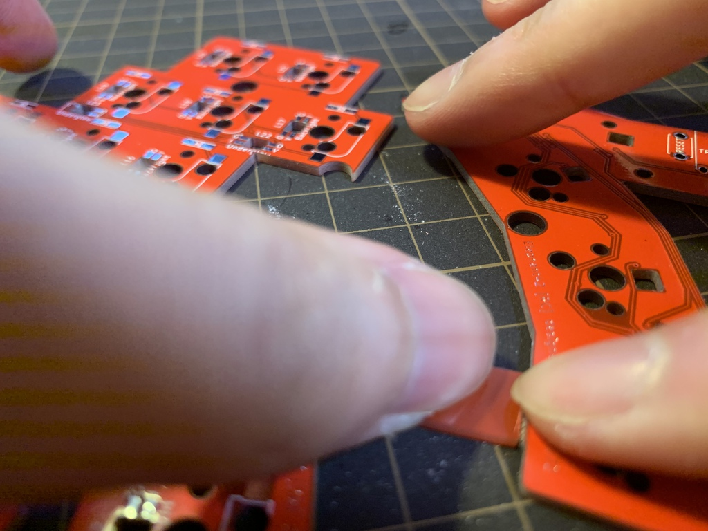 |
| 両サイド両面、ぜんぶで4箇所に切り込みを入れおわりました。 | 他の部分が折れたり曲がったりしないよう注意して折ります。<br/>固いようなら無理して折りとろうとせず、さらにカッターで深く切り込みを入れ直してください。 |
|  | 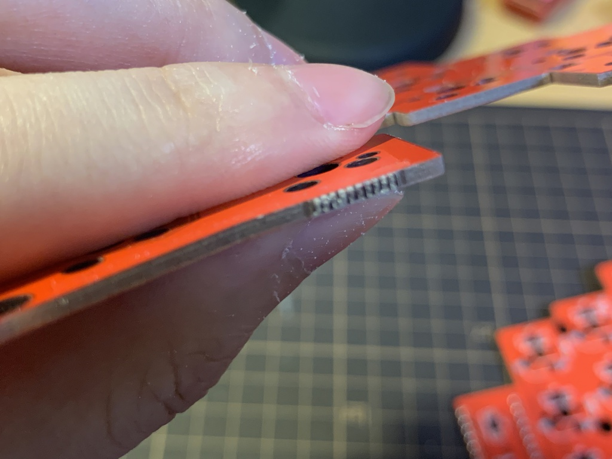 |
| 両サイドとも無事綺麗に折れました。真ん中の小さな破片は不要なので捨てます。 | 折り取った面はギザギザで危ないので、棒やすりで綺麗にします。<br/>やすりがけ作業は粉が飛び散るので、掃除しやすい場所で汚れても良い格好で行うことをおすすめします。 |
|  |
| 綺麗になりました。周囲を指でなぞって真っ平らになっていれば、微妙に縦線が入って見えていても大丈夫です。 |


### (オプション) PCB 側面の色塗り

写真の通り、 PCB 側面はなんか変な色で見栄えが悪く、また完成後もよく見えてしまうので色を塗ってしまうことをおすすめします。

油性ペンで側面をなぞり、表面や裏面についてしまったインクはティッシュやキムワイプで拭き取ります。

| 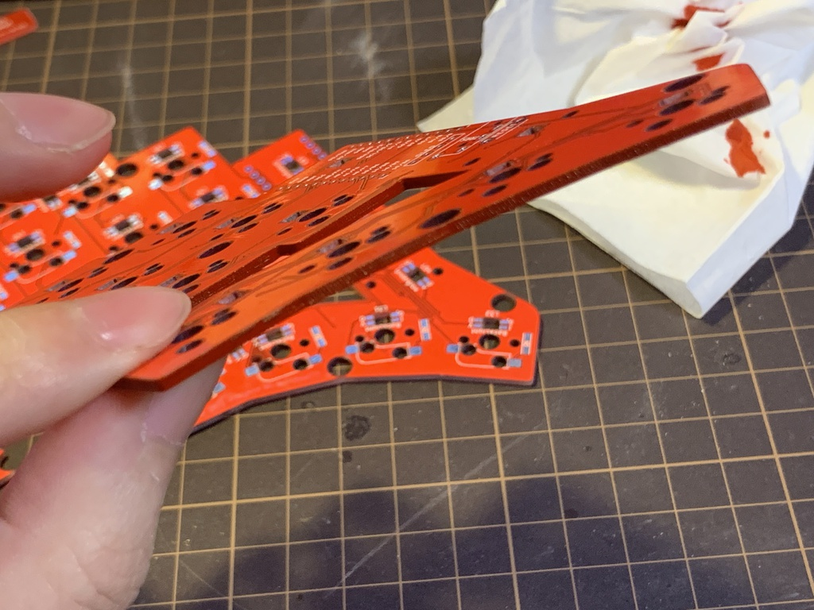 |  |
|:--:|:--:|
| PCB側面をペンで塗ります。はみだしたらすぐに拭き取ります | その後すぐに作業をすると手が汚れるので、乾かします。 |


## Pro Micro とコンスルーのはんだ付け

コンスルーの向きを確認し、写真を参考にして Pro Micro に嵌め込みます。

ProMicro とコンスルーが直角に取り付けられるよう、メイン基板 (PCB) にも嵌め込んだうえでコンスルーと ProMicro をはんだ付けします。

**はんだ付けするのは ProMicro とコンスルーで、メイン基板 (PCB) とコンスルーははんだ付けしません。**

ProMicro とコンスルーのはんだ付けが済んだら、ProMicro(とコンスルーをはんだ付けしたもの) は一度メイン基板から取り外しておきます。


|  |  |
|:--:|:--:|
| コンスルーには向き(窓があいてる/あいてない)があります。 | コンスルーの向きを揃えて、 ProMicro のチップが見える側の面に挿します。 |
|  | 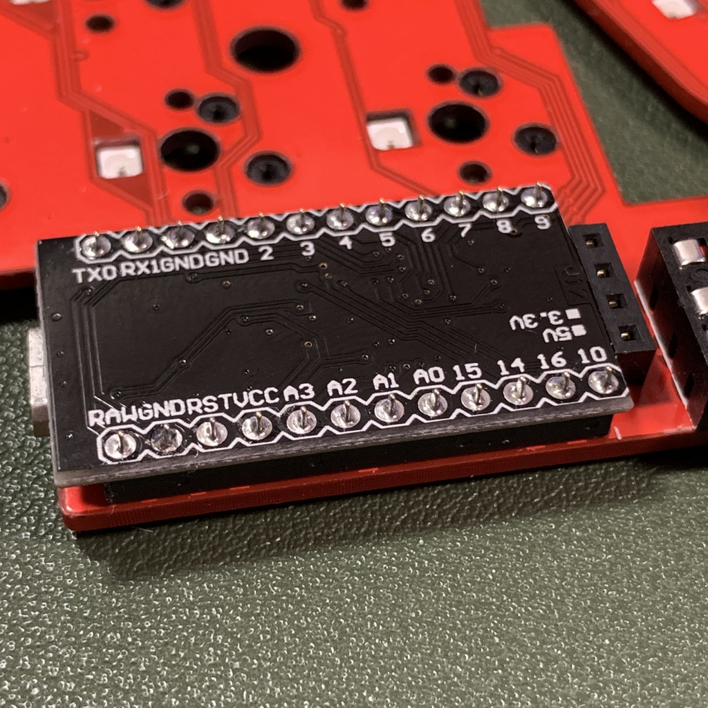 |
| 反対から見た図。コンスルーの向きが揃っているのを確認します。 | メイン基板 (PCB) に嵌めたうえで、各ピンを上からはんだ付けします。<br/>(写真を撮り忘れて後から撮影したので、ProMicro 以外のものも取り付けられていますが見なかったことにしてください。) |


## (オプション) バックライト/アンダーグロウ LED の取り付け


フルカラー LED の取り付けといえば自作キーボード界では最難関の一つとされる作業ですが、新型 LED の登場によりこれまでより格段にラクで安全に取り付けができるようになりました。

以前に挫折した経験のあるかたも、今回あらためて挑戦してみてはいかがでしょう？


### バックライト LED の取り付け

まずはバックライト LED (左手:L1〜L21、右手: L29〜L48) だけ取り付けてしまいます。

はんだ付けにはフラックスを使用すると簡単・綺麗に、かつしっかりと接着させることができます。

| 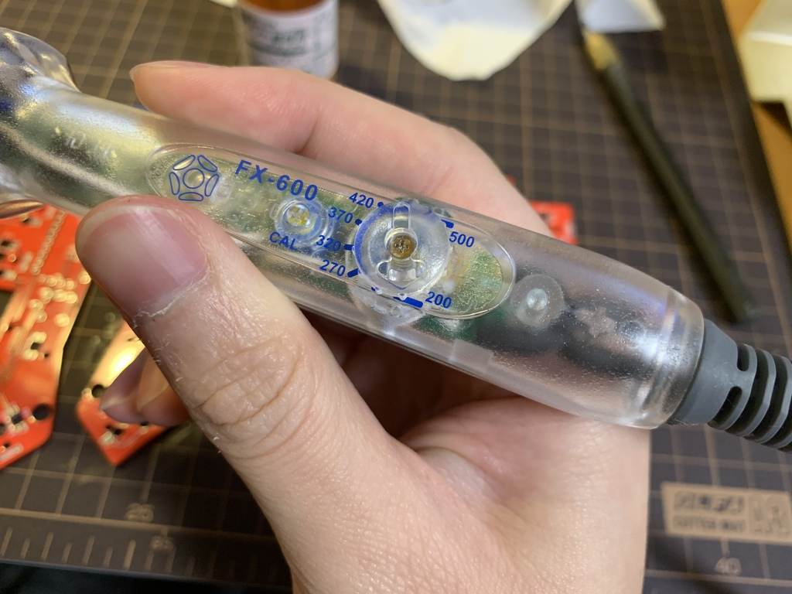 |  |
|:--:|:--:|
| はんだごての温度を低めに設定すると LED を焼き切ってしまう可能性が格段に減ります。<br/>使用するはんだの融点を確認して、なるべく低温で作業してください。 | PCB は裏向き(銀色のパッドが上に来る) に置きます。 |
| 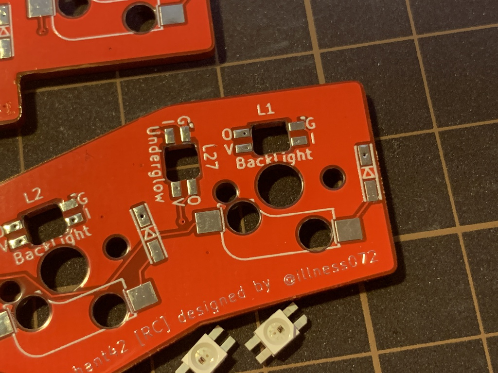 |  |
| LED は白い文字(シルク)で Backlight あるいは Underglow と書かれた四角い穴に取り付けます。<br/>**L1, L2, ... と書かれた取り付け番号順に従って取り付けていってください。** | LED は向きがあります。Backlight は下向きに、Underglow は上向きに配置します。<br/>また LED から伸びた 4 本のタブのうち 1 つだけ切り欠きがあるので、そのタブが 'G' の位置に来るようにします。<br/>**向きが間違っているとLEDは点灯せず、最悪キーボード自体の故障にもつながります。細心の注意をはらって配置してください。** |
| 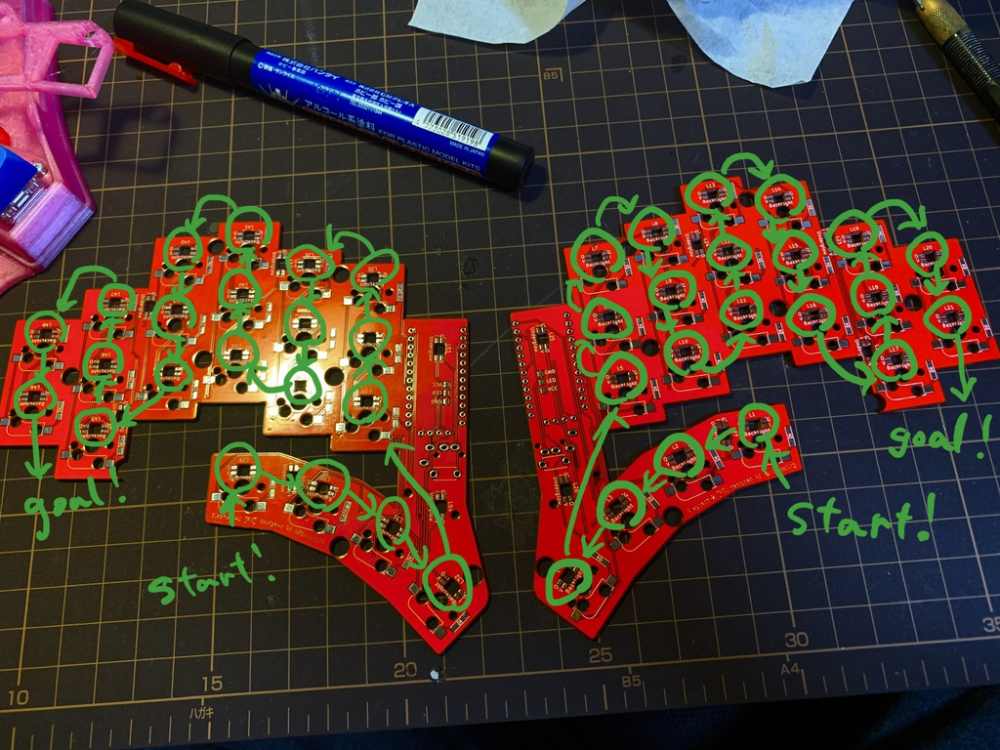 | 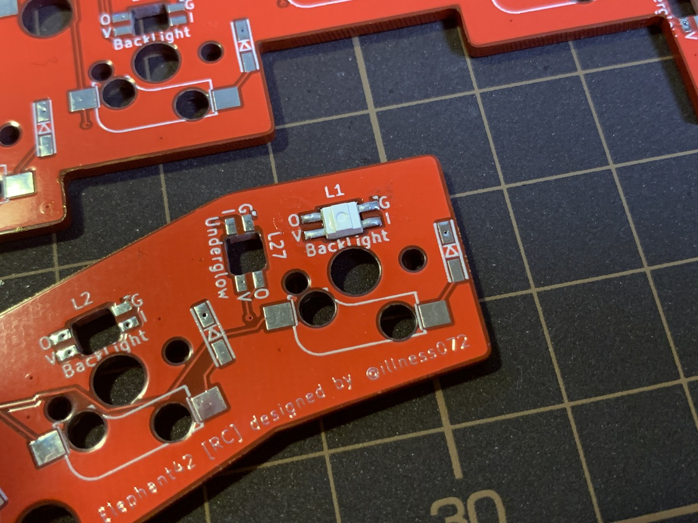 |
| 図のように親指側から小指の順に、LED取り付け穴のそばにある白字の L1, L2 ... の記載(シルク)の番号順にそって取り付けます。 | L1 をはんだ付けしました。LEDのタブが基板から浮いていないか、しっかり目視確認してください。 |


### LED TEST の方法

LED 取り付けば 1 個から数個とりつけるたびに動作確認をしていくとスムーズです。


LED の動作確認用のファームウェアは以下のコマンドで書き込みができます。先ほどの [QMK firmware の書き込み](#qmk-firmware-の書き込み) の手順を参考に書き込んでください。

```
make helix:led_test:flash
```

このファームウェアを焼き込んだ状態の ProMicro を PCBに挿して PC に接続すると「赤→緑→青→赤→...」と順番に点灯してくれます。  
正しく「赤→緑→青→赤→...」とすべての LED が点灯しているかどうかではんだ付けが成功してるかどうか確認できます。

PC がスリープ中だと赤くだけ光って色が変わってくれないことがあります。  
PC がスリープしてない普通の時にテストしましょう。

**良いかんじに取り付け＆テストが進んでいる様子**

|  | 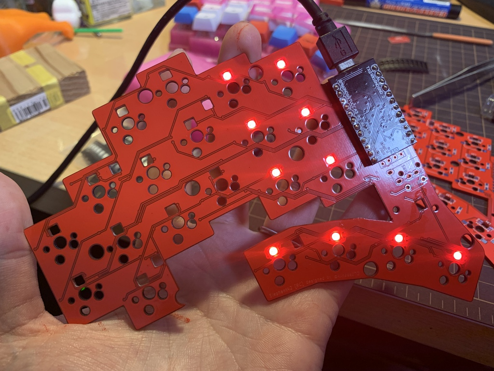 |  | 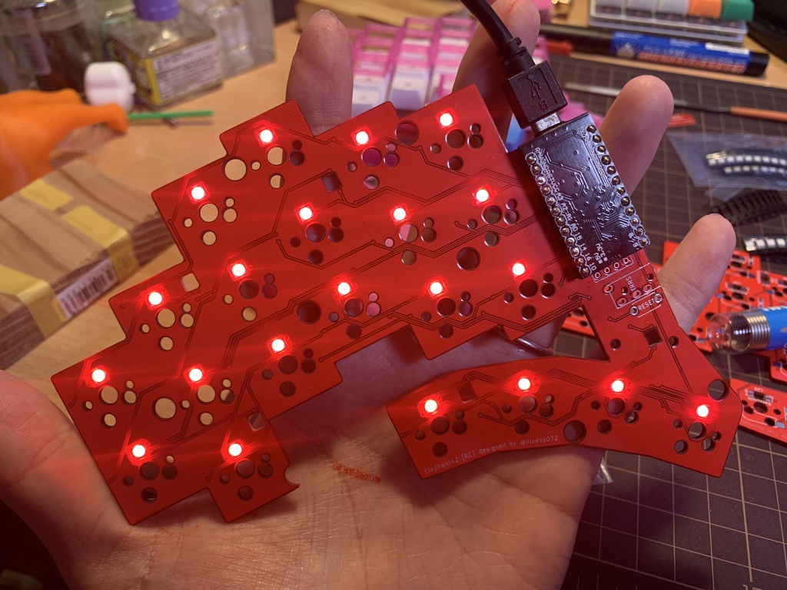 |  |
|:--:|:--:|:--:|:--:|:--:|
|親指のバックライトが光りました|人差し指も光りました|続いて中指と薬指。もうちょっと!|小指も完了。これでバックライトは完了!|アンダーグラウンドもOK。<br/>片手ぶんすべて完了!!|

### アンダーグロウ LED の取り付け

バックライト LED の取り付けが完了して、LED TEST もすべてパスしたらアンダーグロウ LED の取り付けに取り掛かります。

|  | 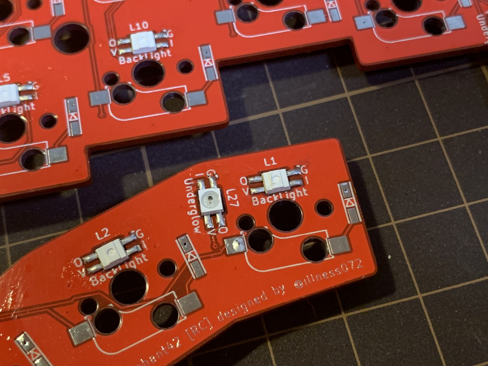 |
|:--:|:--:|
| 次はアンダーグロウです。バックライト同様、シルクの番号順に取り付けます | L27 を取り付けました。バックグラウンドとアンダーグロウは表裏が逆になるので注意してください。 |


### トラブルシューティング

**LED 取り付け穴がきつくて LED が嵌らない**

基板製造の製造誤差によりこうなってしまう場合があります。十分に検品しているつもりですが、抜けがあってすみません。

このような場合は無理に押し込まず、LED 穴の内側を棒やすりで少し削り、穴を広げてみてください。

**光らない LED がある**

その光らない LED か、その 1 つ前の LED がおかしい可能性が高いです。

elephant42 に使用されている YS-SK6812MINI-E でなく、その改良前版の SK6812MINI についての記事ですが、
デバッグ方法がこちらの記事に詳しく書かれていますので、熟読されることをおすすめします。

[コルネキーボードを作りました ～LED取り付けに四苦八苦記～ | キオクノロンダリング](https://marksard.github.io/2018/08/04/make-the-crkbd/) 

YS-SK6812MINI-E のピンアサインは以下の通りなので、SK6812MINI のそれとは異なります。適宜読み替えてください。

| 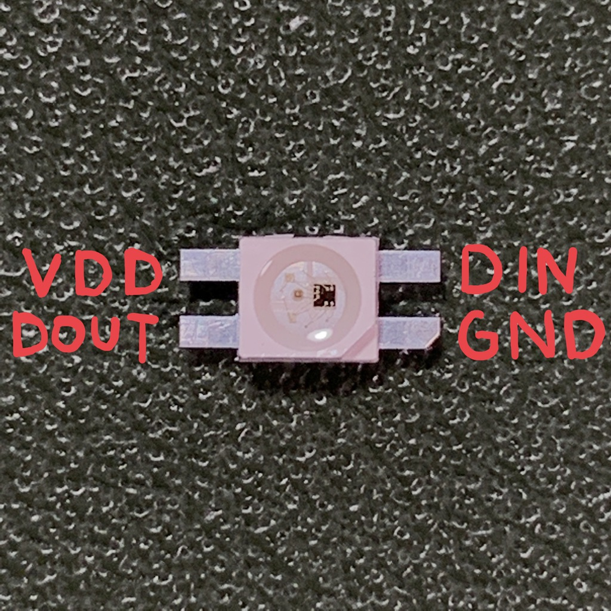 |  |
|:--:|:--:|
| LED ピンアサイン(表) | LED ピンアサイン(裏) |
